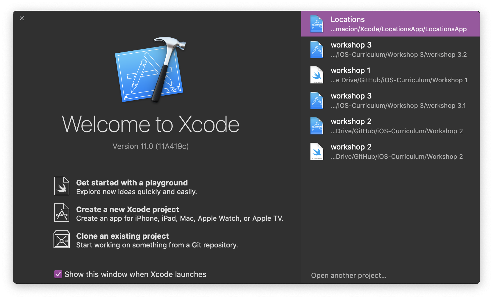
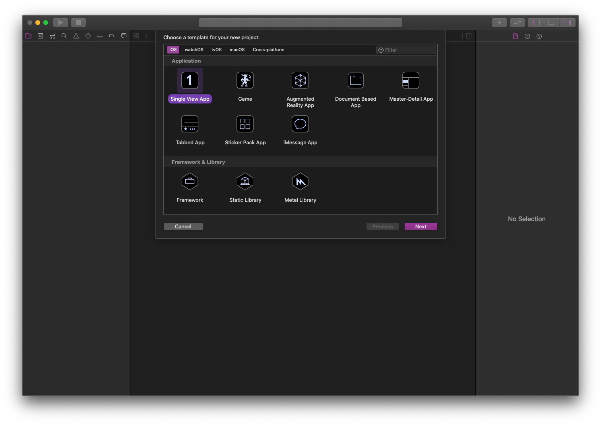
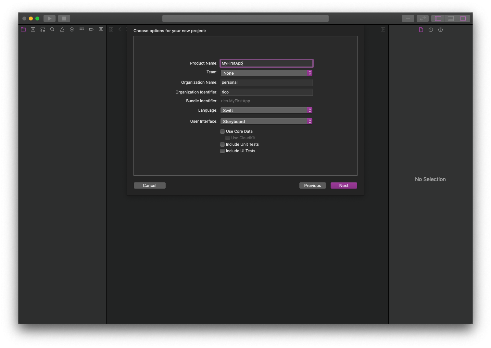
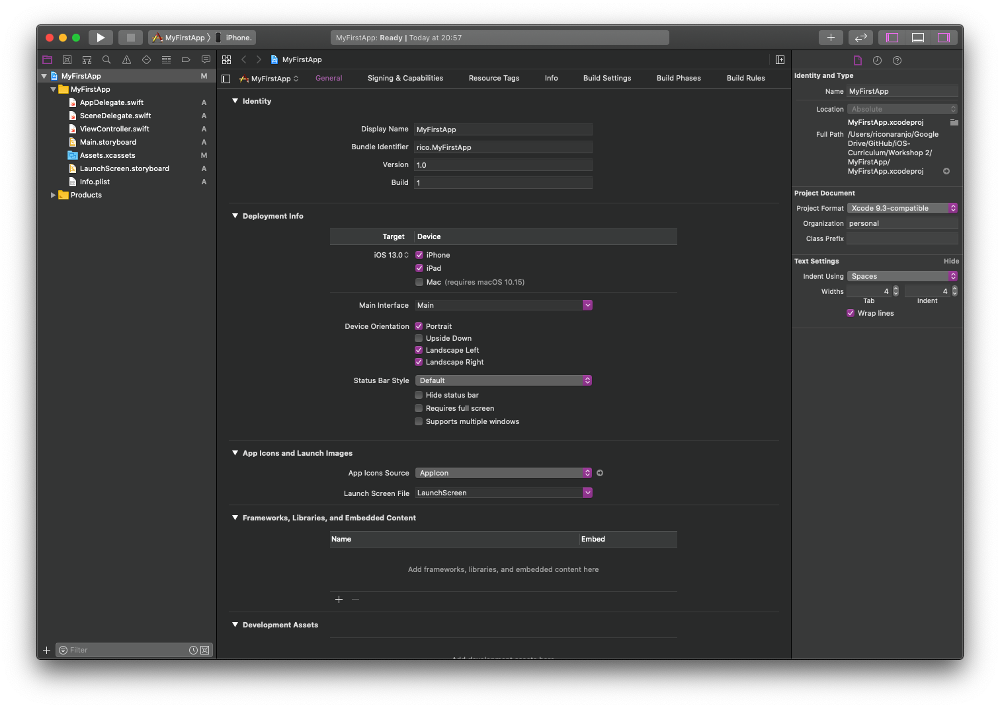
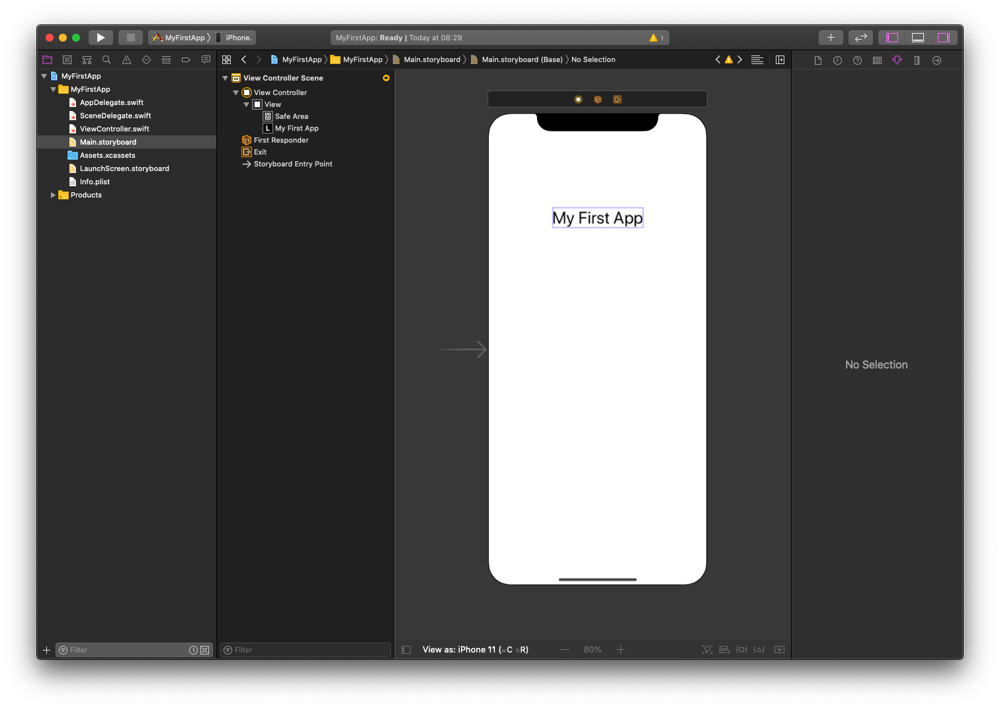
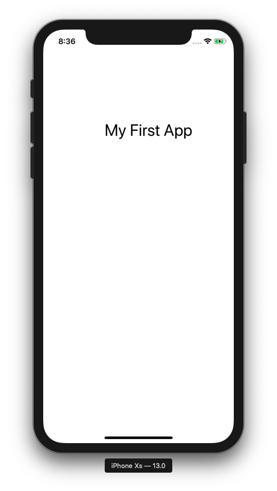

# 2. Getting All Set-up

_This workshop is about learning how to set yourself up with Xcode to create your own iOS apps. We will learn how to create UI elements, and create actions for when you press a button._

| Topics                             | Details                            |
| ---------------------------------- | ---------------------------------- |
| Creating an Xcode Project          | what is it + what is it used for   |
| Xcode layout + shortcuts           | what are all the important things  |
| Creating buttons + textfields      | creating simple UI elements        |
| Creating outlets + actions         | how to tie logic to your UI        |
| Build + Run app on your own iPhone | how to run your own apps           |

`// todo: add links to headers (+ playground pages?)`

# 2.1 The Setup

This workshop will be a quick introduction on how to use Xcode to create iOS apps.

1. **how to create + use an Xcode project**
2. **how to add UI elements + connect them to logic**
3. **how to run your project on your own iPhone**

_First let's start with how to create an Xcode project._

## Xcode Projects

An [Xcode Project](https://developer.apple.com/library/archive/featuredarticles/XcodeConcepts/Concept-Projects.html) is a repository for all the files, resources, and information required to build a software application.

_You can think of it as the box that holds all the pieces and assembly instructions we need to build our app._



Let's create our first **Project** by opening Xcode and selecting the open the **Create a new Xcode project** option in the **Welcome to Xcode** window (if it doesn't show up, press <kbd>cmd</kbd> + <kbd>shift</kbd> + <kbd>1</kbd> to bring it up).

In the window that appears, select the **iOS Single View App** and press next.



Give you app a name like **MyFirstApp**. You don't need change the default settings but make sure you have the following:

- **Language:** Swift
- **User Interface:** Storyboard



The _Organization Name_ and _Organization Identifier_ are used when you submit your app to the App Store so it doesn't really matter what you put in there now.

Once you are ready, press **Next**.

This will ask you where you want to create your project on your computer. Select a location and press **Create**.

This should open your new project in the workspace window. You may have an error that signing for your app requires a development team. This warning means that you haven't set up Xcode for iOS development yet; we will do this later in the workshop.



## Xcode Crash Course

Xcode is a tool used by developers to create and test applications for all of Apple's software platforms; it has everything you need to create your very own app. You can build, run, and debug applications using it's simulator for iOS devices and integrated debugger.

For a more thorough run-through of Xcode's layout, check out this tutorial created by Apple: [Build a Basic UI](https://developer.apple.com/library/archive/referencelibrary/GettingStarted/DevelopiOSAppsSwift/BuildABasicUI.html#//apple_ref/doc/uid/TP40015214-CH5-SW1).

### Xcode Layout

The **Xcode workspace window** is composed of four main components:

- **Navigator area [left]:** Provides quick access to different parts of your project.
- **Editor area [middle]:** Allows you to edit source code, user interfaces, or other resources.
- **Utility area [right]:** Provides information about selected items and access to ready-made resources.
- **Toolbar [top]:** Used to build and run your app, to display task progress, and to configure your work environment.

We will go over each of these components in greater detail when we need them.

Additionally, if you wish to learn more about Xcode, I recommend watching Apple's WWDC 2016 video  [Introduction to Xcode](https://developer.apple.com/videos/play/wwdc2016/413/).

### iOS Simulator

By downloading and installing Xcode, you automatically get an **iOS simulator** so you can actually test your app running on iOS, even if you don't own an iPhone. It also allows you to test your app on various different iPhone models with different screen sizes and resolutions to make sure it works fine on the smallest and biggest iPhones.

In top left corner in the toolbar, select **iPhone Xs** in the scheme pop-up menu. This menu allows you to select which type of iPhone you would like to simulate your app on.

Press the **Run** button to build and run your app. This will run it on the **iPhone Xs** simulator we configured. You can also press <kbd>cmd</kbd> + <kbd>r</kbd> to do this.

If this is your first time running an app, you should get a prompt to enable Developer Mode; this mode allows Xcode to access certain debugging features without asking for your password every time.

_You can see the build progress in the centre of the toolbar, in the **activity viewer**._

Once your app finishes building, it should automatically run on your iOS simulator. It will show your app's launch screen then transition to it's main interface. In the blank template, these will both appear as blank screens.

You can quit the simulator app using <kbd>cmd</kbd> + <kbd>q</kbd>.

## Source Code

The single view app template we created comes with a few predefined source code files that help us set up the app environment.

Let's start with the `AppDelegate.swift` file, you can find it in the project navigator (left). If the project navigator is not visible you can open it with <kbd>cmd</kbd> + <kbd>1</kbd>.

If you click on the file in the project navigator it should open it the editor area; if you double click on the file it will open in a new editor window.

### AppDelegate.swift

The `AppDelegate.swift` source file is automatically created by Xcode in any new project, and you should use it to initialize your app and respond to app-level events.

**This file has two primary functions:**

1. Defining the `AppDelegate` class which creates the root window to display all your content, and also serves as the main point for your app to handle state transitions.
    - _such as your app moving from foreground to the background execution._
2. Creating an entry point to your application — _like a `main()` function_ — and a run loop which delivers input events and notifications to your application.
    - this is done by the `@UIApplicationMain` attribute, which can be found at the top of the class definition.
    - this creates an application object which is responsible for the lifecycle of your app, then assigns it to a singleton `AppDelegate` object, and then the system launches your app.

You can see the `AppDelegate` class definition which contains the `@UIApplicationMain` attribute and shows that it implements the `UIResponder` interface and adopts `UIApplicationDelegate` protocol near the top of the file.

- The `UIResponder` interface defines methods for your app for responding and handling events
- The `UIApplicationDelegate` protocol defines the methods you'll need to set up your app, respond to app state changes, and to handle app-level events.

``` swift
@UIApplicationMain
class AppDelegate: UIResponder, UIApplicationDelegate {
```

The `AppDelegate class` has one property for a reference to the root window object of your application. This property is an optional, which means that it may be `nil` at some point.

``` swift
    var window: UIWindow?
```

This class also has six stub implementations of the `UIApplicationDelegate` methods. These methods allow your application object to communicate with the app delegate and handle app state transitions. During these transitions — such as app launch, moving to background, or termination — the application object will call the app delegate, giving it time to respond and prepare for the transition. The state transition calls are handled by the application object, so you don't have to worry about that.

``` swift
    func application(_ application: UIApplication, didFinishLaunchingWithOptions launchOptions: [UIApplicationLaunchOptionsKey: Any]?) -> Bool
    func applicationWillResignActive(_ application: UIApplication)
    func applicationDidEnterBackground(_ application: UIApplication)
    func applicationWillEnterForeground(_ application: UIApplication)
    func applicationDidBecomeActive(_ application: UIApplication)
    func applicationWillTerminate(_ application: UIApplication)
```

You can leave the stubs with the default behaviour, but once you have a more complex app you might custom behaviour such as saving data to persistent storage before terminating.

In this workshop we won't be defining any custom behaviours here, so there is no need to modify the `AppDelegate.swift` file.

For more information about the `AppDelegate.swift` file, check out this article which breaks it down and explains each section, although it is slightly outdated: [Breaking Down the AppDelegate (swift 3)](https://medium.com/@Dougly/breaking-down-the-appdelegate-swift-3-258e48f907d6)

### ViewController.swift

The `ViewController.swift` source file is also automatically created by Xcode when using the single view application template; this file contains one class and is used to manage a specific scene in your app.

The `ViewController` class is a subclass of [`UIViewController`](https://developer.apple.com/documentation/uikit/uiviewcontroller) which is used for managing the view hierarchy in your iOS app. In this context, a view hierarchy means the hierarchy of UI elements, and how they are displayed; for example a view can have have a background image as well as text and buttons above that, all of these are considered _views_ since they are displayed to the user.

_A view represents a single item on the user interface._

Our default `ViewController` class has only one method; `viewDidLoad()` is called once the view controller's view hierarchy is loaded into memory — _you can see more info if you <kbd>option</kbd> and click on the function name_.

``` swift
import UIKit

class ViewController: UIViewController {

    override func viewDidLoad() {
        super.viewDidLoad()
        // Do any additional setup after loading the view.
    }

    // we will be adding additional functions here
}
```

We will be adding more code in here to give our app more functionality than just a blank screen.

You'll also see that this source file, as well as `AppDelegate.swift` imports the [UIKit](https://developer.apple.com/documentation/uikit) which is the UI framework for iOS applications.

### Main.storyboard

The `Main.storyboard` file is the default storyboard for your new app, it is where you define the user interface design for different scenes within your app. You can define the content of each scene and transitions between scenes here. It allows you to see exactly what the flow — _or story_ — of your app; it allows you to get immediate feedback on how things look, what works, what doesn't work, and allows you to change things quickly and easily.

Select the `Main.storyboard` file in the project navigator. The file will open in the [interface builder](https://developer.apple.com/xcode/interface-builder/), which allows you to edit the user interface and see all your app's scenes on the canvas. If you had a complicated app you would have several storyboard files that linked to each other, but since our app is simple, we will just stick to this storyboard file.

Our storyboard by default has one scene with an arrow pointing into it, this is our initial screen for our app which is the scene which our app opens to, the **storyboard entry point**.

You can change the size of the scenes on the canvas to different iPhone models, which allows you to make sure your UI is adaptive to different screen sizes, not just one model of iPhone.

### LaunchScreen.storyboard

There is a second storyboard file created by Xcode, and that is the `LaunchScreen.storyboard` and this is used to display a static screen when your app is launched, such as a logo or other design.

We won't be modifying this file in this workshop.

## Shortcuts

There are a few useful shortcuts for hiding things like the navigation area, which are especially helpful if you are using a laptop screen with limited screen real estate.

1. **Show / Hide Navigation Area:** <kbd>cmd</kbd> + <kbd>0</kbd>
2. **Show / Hide Utility Area:** <kbd>cmd</kbd> + <kbd>shift</kbd> + <kbd>0</kbd>
3. **Open Developer Documentation:** <kbd>cmd</kbd> + <kbd>shift</kbd> + <kbd>0</kbd>
4. **Show / Hide Debug Area:** <kbd>cmd</kbd> + <kbd>shift</kbd> + <kbd>y</kbd>

# 2.2 Building Your Own App

Now that we have everything set up, we can start actually building our app. Let's start with the `Main.storyboard` file.

We are going to build a simple app that displays a greeting when we enter our name in a text field and press a button.

## Storyboards

As explained earlier, storyboard are used to create the user interface design for your app scenes and the transitions between them. For our app we will just stick to one scene.

Xcode comes with a libary of UI objects that you can add to your scenes to your storyboard files. These include things like text fields and buttons, but also more complex elements like map views. Storyboards allows you to add these views just by dragging and dropping them, that way you can see exactly what your UI will look like immediately.

### Storyboard Layout

The storyboard [interface builder](https://developer.apple.com/xcode/interface-builder/) has two main components:

1. **Dock [left]:** lists all the objects in the storyboard file
2. **Canvas [right]:** where you add object to your app's user interface / scenes

For more info on the interface builder, here is a very thorough page from Apple's documentation: [Using Interface Builder](https://developer.apple.com/library/archive/documentation/ToolsLanguages/Conceptual/Xcode_Overview/UsingInterfaceBuilder.html)

We also want to show the boundaries of the views we add to our scenes, since some of them have transparent boundaries (like default iOS buttons). We can do this by selecting **Editor > Canvas > Show Bounds Rectangles**.

### Adding Labels

Let's start by adding a simple text label; a text label is a `UILabel` object that displays read-only text — _like a header or a title_. We will use it to show our app name.

Press the **Library** button in the toolbar or press <kbd>cmd</kbd> + <kbd>shift</kbd> + <kbd>l</kbd> to show the object library, and type **Label**. Drag and drop the label onto your scene and use the guidelines to centre it. Place it about a fifth of the way from the top.

`// todo: add image of attributes inspector`

_In the utility area [far left] you will find the attributes inspector, and a few other inspector which allow you to change the properties of certain UI elements and scenes._

#### Changing the text

You can edit the text in the label in the **attributes inspector** or you can double click on it and type whatever text you want on your label. Add whatever name you want to name your app, I will use _Hello World_. You might have to re-centre your label since the width of the label probably changed.

#### Changing the font size

To change the font size, you will have to go into the attributes inspector, after selecting the label. You can press the up arrow to increase the text size, next to the **Font** field. I have made my label size 32.

`// todo: add image of attributes inspector font size`

Now you should have a blank scene with your app title centred that looks like this:



Press <kbd>cmd</kbd> + <kbd>r</kbd> to build and run your app in the iOS simulator.

You might notice that the title isn't actually centred, although in the storyboard it looks perfectly centred. This is because when we place UI elements on a scene we aren't necessarily defining a hard-coded location for the view, since our user interface should be adaptive, for different sized screens.

But knowing this doesn't actually solve our problem; how do we make sure our text label is centred regardless of the screen size and resolution? **Constraints**.



#### Constraints

We can add constraints to our text label by selecting it and then pressing the **Align** button at the bottom of the canvas area.

`// todo: add image of align constraints button`

In the pop-up menu select the **Horizontally in Container** option to ensure our label is always centred in our screen regardless of iPhone model, then press **Add 1 Constraint**.

Now that we told Xcode to centre horizontally our label, everything should work right? Then why is Xcode giving us a warning?

_You can see the yellow warning symbol on right side of the activity area of the toolbar._

If you click on the warning symbol, Xcode will give you an explanation of the warning **Vertical position is ambiguous for "Hello World"** — _the text in quotes is simply the label text which may be different for you_.

So we told Xcode to centre our label in the x-direction, but we said nothing about the y-direction. If you re-run your app, you might find that the label no longer appears visible on the screen; this is because it has some position off screen, centred but with a y-value not visible.

We can fix this by adding a vertical contraint for our label. Click on the **Add new Constraints** button, to the right of the **Align** button.

`// todo: add image of adding vertical constraint`

In the pop-up menu, select the top constraint, give it a value of 100, and press **Add 1 Constraint**. This will make sure that your label is always the same distance from the top of the screen, regardless of screen size.

Rerun your app, and see if your title is now properly centred.

Let's add a second label below our title, this is where we will display our personalized greeting to our users. Press <kbd>cmd</kbd> + <kbd>shift</kbd> + <kbd>l</kbd> to bring up the object library, and drag a label below our title label. Change the text on it to **Greetings!** by double clicking it.

Add a horizontal constraint so it's centred horizontally in the **Align** options.

Press the **Add new Constraints** button again and add a top contraint of 25, and apply it.

You can rerun your app, and check that everything is in the right place.

### Adding Text Fields

Now let's add a text field so our users can type in their name, for a personalized greeting.

Press <kbd>cmd</kbd> + <kbd>shift</kbd> + <kbd>l</kbd> to bring up the object library and search for a text field, then drag and drop it below our label. Drag the edges of the text field to the margins of the scene.

`// todo: add image of text label + margins`

Our users are going to enter their names into this field, but how will they know to do so? We can add placeholder text that says something like **Enter your name here** to guide our user. To do this, select the text field and click on the attribute inspector in the utility area on the right. Enter the text in the **Placeholder** field.

We can also change the **Text Input Traits** such as capitalizing all words or changing the return key to say **Done** or something else. Set the capitalization trait to words since we want names to be capitalized.

Now let's add constraints so it always appears centred below our title, and spans the width of our screen, even on different iPhone models like the SE or iPhone Xs Max.

Press the **Add new Constraints** button again and select the top, left, and right constraints. Change the top constraint value to 100, and the left and right constraints to 50 each. Press the **Add 3 Constraints** button to apply these.

`// todo: add image of title + greeting label`

If you want to see your changes without re-building and running your app every time, you can preview your changes right in the storyboard interface builder.

#### Assistant Editor

Press the **Assistant Editor** button in the toolbar to bring it up. By default it should show you the view controller for the selected scene, but we don't need that right now.

In the editor selector bar, change the assistant editor to **Preview > Main.storyboard** from **Automatic**. You can find it at the top of the assistant editor.

Here you can quickly add different iPhone screen size – _using the `+` sign at the bottom left of the assistant editor_ — and also rotate to make sure your UI is properly adaptive, and things are working as intended.

### Adding Buttons

Let's now add a button, we're going to use it to trigger our greeting.

Press <kbd>cmd</kbd> + <kbd>shift</kbd> + <kbd>l</kbd> to bring up the object library and search for a button. Drag and drop it below our text field and change the text to **Hi** on it by double clicking it.

**Once again add constraints to it:**

- aligned in the centre horizontally
- top contraint of 25

Check that everything is correct in the assistant editor preview.

### Outlets

Now that we have our UI all finished, it's now time to start coding the logic of our application.

In order to access our UI elements in code, we need to create a reference to the element in the interface builder in our code. We can do this by creating an outlet — _an outlet is simply a variable with the `@IBOutlet` property_ — in our view controller.

The easiest way of doing is by using the assistant editor in **Automatic**, this should bring up the `ViewController.swift` file. Once you have it visible next to your storyboard, hold <kbd>ctrl</kbd> and drag the greeting text label into the code below the class definition.

`// todo: add image of outlet creation`

You should get a pop-up menu with a few options, we will only be editing the **Name** field.

- **Connection:** type of connection (outlet or outlet collection for a label)
  - _we will leave it at outlet since it is only a reference to one label_
- **Object:** object to which our item belongs to
- **Name:** variable name for item reference
  - _give it a descriptive name like **greetingsLabel**_
- **Type:** class of UI object
- **Weak / Strong:** whether we want the object to never be destroyed
  - _we want a weak reference, so that we don't use up extra memory when the scene isn't loaded_

_more info about weak vs. strong references: [Should IBOutlets be weak or strong?](https://www.zerotoappstore.com/should-iboutlets-be-weak-or-strong.html)_

Press **Connect**. This will create a line of code in your `ViewController` class:

``` swift
@IBOutlet weak var greetingLabel: UILabel!
```

We need this reference in order to update the text in our label once we press our button.

Let's repeat this with the text field so we can read the user's first name, naming it something descriptive like `nameTextField`.

``` swift
@IBOutlet weak var nameTextField: UITextField!
```

### Actions

Now let's add an action to our button, so we can trigger something to happen when it's pressed. Creating an action is very similar to creating an outlet, but this time we want to make sure the **Connection** is an **Action**.

Hold <kbd>ctrl</kbd> and drag the button into the code below the label outlet, and change the **Connection** to **Action** and **Name** to **greetingButton**.

Leave the action **Type** fields with their default values:

- **Any:** this can be UIButton, but it is useful when you have multiple views trigger the same action.
- **Touch Up Inside:** event where finger is inside bounds of view
  - _more info about events: [UIControl.event](https://developer.apple.com/documentation/uikit/uicontrol/event)_
- **Sender:** how much info is sent to action, sender just means the button reference in this case.
  - _useful explanation: [Stack Overflow](https://stackoverflow.com/questions/24147222/what-is-the-difference-between-the-arguments-sender-and-none-for-an-ibaction)_

Instead of creating a variable as when creating an outlet, creating an action creates a function inside our view controller. It should look like this (without the comment):

``` swift
@IBAction func greetingButton(_ sender: Any) {
    // code here is executed when our button is pressed
}
```

Let's add a simple print function to make sure our button is actually triggering our action. Add the print statement inside our `greetingButton()` method.

``` swift
@IBAction func greetingButton(_ sender: Any) {
    print("button was pressed")
}
```

Run your app, and make sure that you can see the text `button was pressed` in Xcode's terminal every time you press your button.

_A quick breakdown of the difference between actions and outlets can be found in the article: [Outlet vs Action Connections in Xcode](https://medium.com/@GanChau/outlet-vs-action-connections-in-xcode-b5331fb233a1)_

### Personalized Greetings

Now that we have everything set up and connected, let's make our app give a personalized greeting to the user.

Write this logic in your `greetingButton()` function.

``` swift
@IBAction func greetingButton(_ sender: Any) {
    if let name = nameTextField.text {
        greetingLabel.text = "Hi there, \(name)!"
    }
}
```

The `if let` statement creates a `String` variable from the text field `String?` text attribute, which should hopefully hold our user's first name. If this conversion is successful, then we change the greeting label below our title to say **"Hey there, Timmy!"** — _assuming Timmy was in the text field_ —.

_Run your app and see if this works._

This works right? What if the text field is empty and the user presses our button? Our personalized greeting will say **"Hey there, !"**. This doesn't look so good.

Let's make it so, if our text field is empty, the title reverts back to the default text **"Greetings!"**. Add a statement which checks if the text field is empty, and if it is, it sets the greeting label's text back to **"Greetings!"**.

``` swift
@IBAction func greetingButton(_ sender: Any) {
    if nameTextField.text == "" {
        greetingLabel.text = "Greetings!"
    } else if let name = nameTextField.text {
        greetingLabel.text = "Hi there, \(name)!"
    }
}
```

Now you might think our app is fool-proof, everything will work as expected always, right?

What if the user simply puts a bunch of spaces instead of their name? Or, what if they add a bunch of spaces before or after their name? Try this and see what your personalized greetings look like in these use-cases.

We can trim whitespace — tabs (`\t`) and blank spaces (`\b`) — in use the `.trimmingCharacters(in: .whitespaces)` method call to remove leading and trailing whitespaces from our name text field.

``` text
'  Timmy' becomes 'Timmy' (leading)
```

``` text
'Anna   ' becomes 'Anna' (trailing)
```

``` text
' Derek ' becomes 'Derek' (leading + trailing)
```

``` text
'  ' becomes ''
```

Add this method to the conditionals of the `if` statements to check for empty strings as well as leading and trailing whitespaces.

``` swift
@IBAction func greetingButton(_ sender: Any) {
    if nameTextField.text?.trimmingCharacters(in: .whitespaces) == "" {
        greetingLabel.text = "Greetings!"
    } else if let name = nameTextField.text?.trimmingCharacters(in: .whitespaces) {
        greetingLabel.text = "Hi there, \(name)!"
    }
}
```

Now when a user wants a personalized and if they accidentally added spaces, then their name will still show up properly.

_Congrats, you have finished your first iOS app!_

## Running Your Own App

We've already covered how to run your app in Xcode's included iOS simulator, using either the run button or <kbd>cmd</kbd> + <kbd>r</kbd>.

If you own an iPhone, you can use Xcode to load, run, and debug apps on it. This is how to set it up.

- Navigate to the Xcode project file: **Signing > Team >> Add an Account...** and log into your iCloud account
- Plug your iPhone in to your computer
- Select your iPhone to change your build scheme in the left side of the toolbar.
  - if it's missing add your device in **Add Additional Simulators...**

Here is a useful article by Twilio on how to set things up to run apps on your iPhone:[How to Test Your iOS Application on a Real Device](https://www.twilio.com/blog/2018/07/how-to-test-your-ios-application-on-a-real-device.html)

# References

This are some of the resources I used to make this workshop, all of them are worth reading / watching.

- [Build a Basic UI](https://developer.apple.com/library/archive/referencelibrary/GettingStarted/DevelopiOSAppsSwift/BuildABasicUI.html#//apple_ref/doc/uid/TP40015214-CH5-SW1)
- [Introduction to Xcode](https://developer.apple.com/videos/play/wwdc2016/413/)
- [Breaking Down the AppDelegate (swift 3)](https://medium.com/@Dougly/breaking-down-the-appdelegate-swift-3-258e48f907d6)
- [Google](https://google.ca)
- [Stack Overflow](https://stackoverflow.com)
